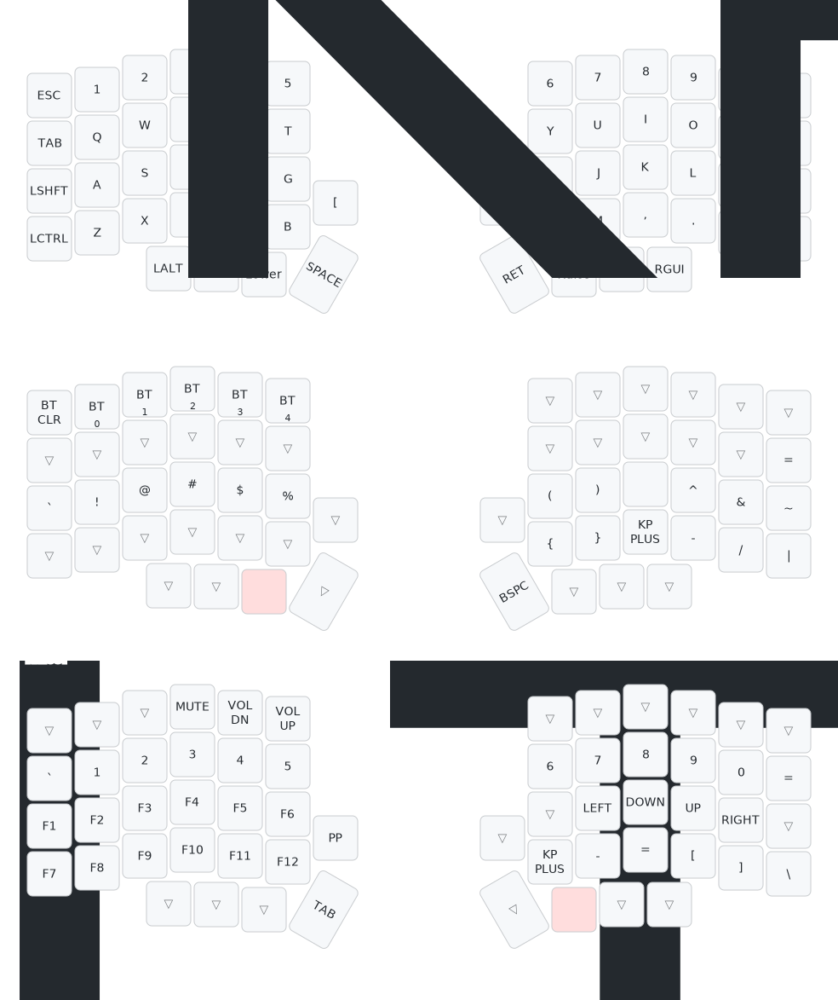

# Lily58 Keyboard
## Keymap

## Rebuilding the firmware
1. Go to actions
2. Go to `.github/workflows/build.yml` on the sidebar
3. Run the workflow
4. Wait for the workflow to complete, download both of the `uf2` files

## Regenerating the keymap visual
https://keymap-drawer.streamlit.app/

## List of ZMK Keycodes
https://zmk.dev/docs/keymaps/list-of-keycodes
